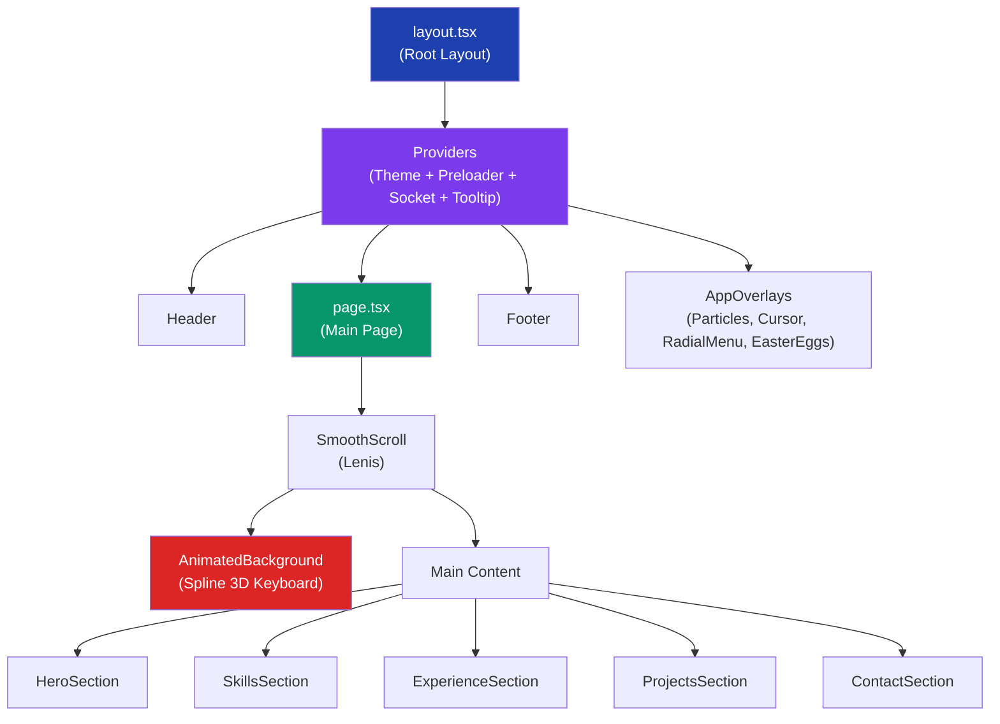
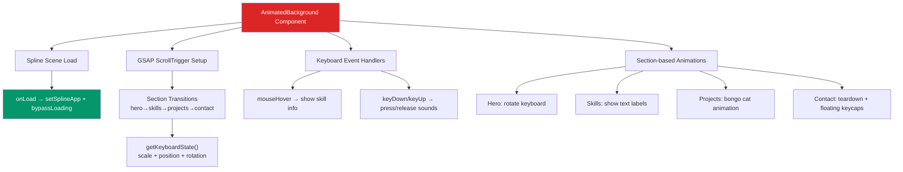
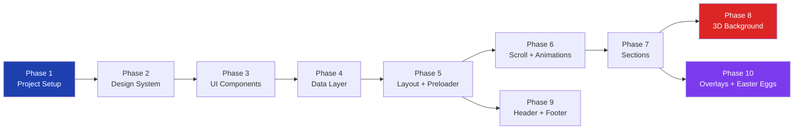

# 🚀 Lộ Trình Code Lại 3D Portfolio — Từ Rễ Đến Ngọn

## Tổng Quan Dự Án

Đây là một **portfolio cá nhân tương tác 3D** được xây dựng với Next.js, nổi bật bởi bàn phím 3D (Spline), hiệu ứng particle nền, smooth scroll, và nhiều easter egg thú vị.

### Kiến Trúc Tổng Thể



### Tech Stack

| Công nghệ | Vai trò | Tầm quan trọng |
|---|---|---|
| **Next.js 16** | Framework React (App Router) | ⭐⭐⭐⭐⭐ |
| **TypeScript** | Type safety | ⭐⭐⭐⭐⭐ |
| **Tailwind CSS 3** | Styling + Design System | ⭐⭐⭐⭐⭐ |
| **Framer Motion** (`motion`) | Animations & transitions | ⭐⭐⭐⭐⭐ |
| **Spline** | 3D keyboard model | ⭐⭐⭐⭐ |
| **GSAP** | Scroll-driven animations | ⭐⭐⭐⭐ |
| **Lenis** | Smooth scrolling | ⭐⭐⭐ |
| **Radix UI** | Headless UI components | ⭐⭐⭐ |
| **Shadcn/UI** | Component library | ⭐⭐⭐ |
| **Zod** | Form validation | ⭐⭐ |
| **Resend** | Email API | ⭐⭐ |
| **Socket.io** | Realtime cursors/users | ⭐⭐ |
| **SCSS Modules** | Scoped styling (Header/Nav) | ⭐⭐ |

---

## Cấu Trúc Thư Mục

```
src/
├── app/                    # Next.js App Router
│   ├── layout.tsx          # Root layout (fonts, metadata, providers)
│   ├── page.tsx            # Trang chính
│   ├── globals.css         # CSS variables + Tailwind base
│   ├── not-found.tsx       # Trang 404 (Spline 3D)
│   ├── api/send/           # API gửi email (Resend)
│   └── blogs/              # Blog pages (MDX)
├── components/
│   ├── sections/           # 5 sections chính: hero, skills, experience, projects, contact
│   ├── header/             # Header + Navigation (Framer Motion animations)
│   ├── footer/             # Footer
│   ├── preloader/          # Loading screen (GSAP tween)
│   ├── ui/                 # Shadcn components + custom UI
│   ├── radial-menu/        # Context menu (right-click)
│   ├── realtime/           # Online users + Remote cursors (Socket.io)
│   ├── theme/              # Theme toggle (funny version)
│   ├── social/             # Social media buttons
│   ├── logos/              # Custom logo SVGs
│   ├── animated-background.tsx  # ⭐ CORE: Spline 3D + GSAP scroll
│   ├── animated-background-config.ts  # Keyboard states per section
│   ├── smooth-scroll.tsx   # Lenis wrapper
│   ├── reveal-animations.tsx  # BlurIn, BoxReveal components
│   ├── Particles.tsx       # Floating particles background
│   ├── providers.tsx       # All context providers wrapper
│   └── ...
├── data/
│   ├── config.ts           # Site metadata (name, email, social links)
│   ├── constants.ts        # Skills enum, experience data, theme messages
│   └── projects.tsx        # Projects data (JSX content)
├── contexts/
│   └── socketio.tsx        # Socket.io context provider
├── hooks/                  # Custom hooks (media query, mouse, throttle)
├── lib/                    # Utilities (cn, Lenis, MDX, avatar)
├── types/                  # TypeScript types
└── utils/                  # Mouse utilities
```

---

## 10 Giai Đoạn Code

> [!IMPORTANT]
> Mỗi giai đoạn xây dựng dựa trên giai đoạn trước. **KHÔNG nhảy cóc**. Hoàn thành và test từng bước trước khi tiến sang bước tiếp theo.

---

### 📦 Phase 1: Khởi Tạo Dự Án & Cấu Hình

**Mục tiêu:** Tạo project Next.js, cài dependencies, thiết lập config cơ bản.

**Kiến thức cần nắm:**
- Next.js App Router (khác gì Pages Router)
- TypeScript cơ bản
- Tailwind CSS setup
- `pnpm` package manager

**Files tạo/cấu hình:**

| File | Mô tả |
|---|---|
| `package.json` | Dependencies: next, react, tailwindcss, motion, gsap, etc. |
| `next.config.mjs` | Security headers, caching, strict mode |
| `tailwind.config.ts` | Dark mode, custom fonts, CSS variables, color tokens |
| `tsconfig.json` | Path aliases (`@/`) |
| `postcss.config.mjs` | PostCSS + Tailwind |
| `.env.example` | Environment variables template |

**Bước thực hiện:**
1. `npx create-next-app@latest ./ --typescript --tailwind --app --src-dir`
2. Cài các dependencies chính:
   ```
   pnpm add motion gsap @gsap/react lenis @splinetool/react-spline @splinetool/runtime
   pnpm add @radix-ui/react-dialog @radix-ui/react-tooltip @radix-ui/react-toast
   pnpm add class-variance-authority clsx tailwind-merge tailwindcss-animate
   pnpm add lucide-react react-icons zod resend sass next-themes
   ```
3. Cấu hình `tailwind.config.ts` với custom fonts, CSS variable colors, `darkMode: ["class"]`
4. Cấu hình `next.config.mjs` với security headers

**Khái niệm học được:**
- CSS Custom Properties (HSL color system) cho theming
- Plugin `addVariablesForColors` — biến mỗi Tailwind color thành CSS var
- Font loading với `next/font/google` (Inter + Archivo Black)

---

### 🎨 Phase 2: Design System — globals.css + Shadcn UI

**Mục tiêu:** Thiết lập design tokens (colors, fonts, radius) cho light/dark mode.

**Files tạo:**

| File | Mô tả |
|---|---|
| `src/app/globals.css` | CSS variables cho light/dark, `.canvas-overlay-mode` utility |
| `src/lib/utils.ts` | `cn()` — merge classnames (clsx + tailwind-merge) |
| `components.json` | Shadcn config |

**Kiến thức:**
- Hệ thống HSL color trong CSS: `--primary: 222.2 47.4% 11.2%` → `hsl(var(--primary))`
- `canvas-overlay-mode`: trick thông minh — disable `pointer-events` trên overlay canvas, nhưng enable lại cho text/buttons
- `cn()` utility: kết hợp `clsx` (conditional classes) + `tailwind-merge` (loại bỏ conflict)

**Lưu ý đặc biệt:**
```css
/* Đây là pattern quan trọng nhất của project */
.canvas-overlay-mode {
  pointer-events: none;  /* 3D canvas nằm fixed, overlay lên content */
}
.canvas-overlay-mode a, .canvas-overlay-mode button, ... {
  pointer-events: auto;  /* Nhưng vẫn click được text/buttons */
}
```

---

### 🧱 Phase 3: UI Components Cơ Bản

**Mục tiêu:** Tạo các UI components reusable (Button, Card, Badge, Typography, etc.)

**Files tạo:**

| File | Mô tả |
|---|---|
| `src/components/ui/button.tsx` | CVA-based button (variants: default, outline, ghost, link) |
| `src/components/ui/card.tsx` | Card + CardHeader + CardContent + CardTitle |
| `src/components/ui/badge.tsx` | Badge component |
| `src/components/ui/label.tsx` | Form label |
| `src/components/ui/tooltip.tsx` | Radix Tooltip |
| `src/components/ui/toast.tsx` | Toast notification |
| `src/components/ui/toaster.tsx` | Toast container |
| `src/components/ui/use-toast.ts` | Toast hook |
| `src/components/ui/typography.tsx` | TypographyH1-H4, TypographyP |
| `src/components/ui/section-wrapper.tsx` | ⭐ Section with scroll-driven opacity/scale |
| `src/components/ui/scroll-area.tsx` | Radix ScrollArea |
| `src/components/ui/ace-input.tsx` | Styled input (Aceternity style) |
| `src/components/ui/ace-textarea.tsx` | Styled textarea |

**Kiến thức:**
- **CVA (Class Variance Authority):** Pattern tạo component với variants
  ```ts
  const buttonVariants = cva("base-classes", {
    variants: { variant: { default: "...", outline: "..." } }
  })
  ```
- **Radix UI:** Headless, accessible components (chỉ cung cấp logic, tự style)
- **SectionWrapper:** Hook `useScroll` + `useTransform` từ Framer Motion → fade in/out khi scroll

---

### 📝 Phase 4: Data Layer — Config & Constants

**Mục tiêu:** Tạo centralized data (thông tin cá nhân, skills, experience, projects).

**Files tạo:**

| File | Mô tả |
|---|---|
| `src/data/config.ts` | Site metadata: tên, email, social links, OG image |
| `src/data/constants.ts` | `SkillNames` enum, `SKILLS` record, `EXPERIENCE` array |
| `src/data/projects.tsx` | Projects data với JSX content (SlideShow, Typography) |

**Kiến thức:**
- TypeScript `enum` cho skill names → type-safe references
- `Record<SkillNames, Skill>` — đảm bảo mỗi skill phải có data
- JSX trong data files — `get content()` getter trả về React component
- Pattern `PROJECT_SKILLS` — tách skill definitions khỏi project data

**Lưu ý:** File `projects.tsx` là file lớn nhất (~700 lines) vì chứa JSX content cho mỗi project. Đây là nơi bạn customize nội dung portfolio của mình.

---

### 🖼️ Phase 5: Layout + Theme + Preloader

**Mục tiêu:** Xây dựng root layout, theme provider, và loading screen.

**Files tạo:**

| File | Mô tả |
|---|---|
| `src/app/layout.tsx` | Root layout: fonts, metadata, SEO, providers |
| `src/components/providers.tsx` | Provider wrapper: Theme → Preloader → Socket → Tooltip |
| `src/components/theme-provider.tsx` | `next-themes` ThemeProvider |
| `src/components/preloader/index.tsx` | ⭐ Loading context + AnimatePresence |
| `src/components/preloader/loader.tsx` | Loading UI animation |
| `src/components/preloader/anim.ts` | Loader animation variants |
| `src/components/preloader/style.module.scss` | Loader styles |

**Kiến thức quan trọng:**

1. **Preloader Pattern:** React Context cung cấp `isLoading` + `bypassLoading`
   ```
   Preloader Context → { isLoading, loadingPercent, bypassLoading }
   ```
   - GSAP tween `loadingPercent` từ 0→100 trong 2.5s
   - `bypassLoading()` cho phép skip loading (gọi khi Spline load xong)
   - `AnimatePresence` để animate out loader

2. **Provider Nesting Order:** ThemeProvider → Preloader → SocketProvider → TooltipProvider
   - Order matters! Theme phải ở ngoài cùng để tất cả components đều access được

3. **Metadata (SEO):** OpenGraph, Twitter Cards, robots — tất cả configured trong layout

---

### 🌊 Phase 6: Smooth Scroll + Reveal Animations

**Mục tiêu:** Thêm smooth scrolling và animation components.

**Files tạo:**

| File | Mô tả |
|---|---|
| `src/components/smooth-scroll.tsx` | Lenis smooth scroll wrapper |
| `src/lib/lenis/` | Lenis React integration |
| `src/components/reveal-animations.tsx` | BlurIn, BoxReveal, RevealAnimation |
| `src/components/scroll-down-icon.tsx` | Animated scroll indicator |
| `src/components/sections/section-header.tsx` | Section title with BoxReveal |

**Kiến thức:**
- **Lenis:** Library cho smooth, buttery scrolling. Config: `duration: 2`, `prevent` for modals
- **BlurIn:** Framer Motion animation — blur(10px) → blur(0px) + opacity
- **BoxReveal:** Hai animation song song:
  1. Content: opacity 0 → 1, y 75 → 0
  2. Colored box: left 0 → 100% (sliding reveal effect)
- **SectionHeader:** Sticky title + BoxReveal → header dính lại khi scroll qua section

---

### 🏠 Phase 7: Các Sections Chính (Hero → Contact)

**Mục tiêu:** Code 5 sections chính của trang.

**Files tạo:**

| File | Mô tả |
|---|---|
| `src/components/sections/hero.tsx` | Hero: name, title, CTA buttons, social links |
| `src/components/sections/skills.tsx` | Skills: section wrapper (3D handled separately) |
| `src/components/sections/experience.tsx` | Experience: timeline cards with Framer Motion |
| `src/components/sections/projects.tsx` | Projects: grid + modal dialog |
| `src/components/sections/contact.tsx` | Contact: form with card |
| `src/components/ContactForm.tsx` | Form logic: Zod validation, API call |
| `src/components/ui/responsive-dialog.tsx` | Desktop Dialog / Mobile Drawer |
| `src/components/ui/floating-dock.tsx` | Tech stack icon dock (hover animation) |
| `src/components/slide-show.tsx` | Image slideshow for project content |
| `src/app/page.tsx` | Main page: compose all sections |

**Kiến thức cho từng section:**

#### Hero Section
- Grid 2 columns: text (left) + 3D keyboard space (right)
- `usePreloader()` → chỉ show content sau khi loading xong
- BlurIn animations với delay staggering (0.7s → 1s → 1.2s)
- Tooltip easter egg trên tên

#### Skills Section
- Cực kỳ đơn giản! Chỉ là SectionWrapper + SectionHeader
- Actual skills display nằm trong 3D keyboard (Phase 8)
- `pointer-events-none` vì 3D canvas xử lý interaction

#### Experience Section
- Map qua `EXPERIENCE` array → `ExperienceCard` components
- `motion.div` với `whileInView` → animate khi scroll vào view
- Timeline line (vertical border) + stagger delay (`index * 0.1`)
- Skill badges với icons từ CDN

#### Projects Section
- `ResponsiveDialog` — Dialog trên desktop, Drawer trên mobile
- Project cards: Image + gradient overlay + title
- Modal content: Sticky header + scrollable body
- `FloatingDock` — animated tech stack icons
- `SlideShow` — Splide carousel cho screenshots

#### Contact Section
- Contact form với Zod schema validation
- API route `/api/send` sử dụng Resend SDK
- Toast notifications cho success/error
- `BottomGradient` — hover effect trên submit button

---

### 🎹 Phase 8: Spline 3D Background (CORE) ⭐

**Mục tiêu:** Tích hợp 3D keyboard model + GSAP scroll animations.

> [!WARNING]
> Đây là phần phức tạp nhất! File `animated-background.tsx` có ~440 lines với nhiều interaction patterns.

**Files tạo:**

| File | Mô tả |
|---|---|
| `src/components/animated-background.tsx` | ⭐ Spline load + GSAP scroll + keyboard interactions |
| `src/components/animated-background-config.ts` | Keyboard transform states per section |

**Kiến trúc AnimatedBackground:**



**Kiến thức quan trọng:**

1. **Spline Integration:**
   - `React.lazy(() => import('@splinetool/react-spline'))` — lazy load
   - `Suspense` fallback while loading
   - `onLoad` callback → nhận `Application` instance
   - `.findObjectByName()` — tìm 3D object để animate
   - `.setVariable()` — set text variables trong Spline scene
   - `.addEventListener()` — listen keyboard/mouse events

2. **GSAP ScrollTrigger:**
   - `ScrollTrigger` plugin — trigger animations dựa trên scroll position
   - `createSectionTimeline()` — tạo timeline cho mỗi section transition
   - `onEnter` / `onLeaveBack` — forward/backward scroll handlers
   - `scrub: true` — animation sync với scroll speed

3. **Keyboard State Machine:**
   ```
   getKeyboardState({ section, isMobile }) → { scale, position, rotation }
   ```
   - Mỗi section có transform riêng (hero → nhỏ bên phải, skills → center, etc.)
   - Responsive: desktop vs mobile states
   - Scale offset dựa trên `window.innerWidth`

4. **Animation Patterns:**
   - **Bongo Cat:** Frame animation (toggle frame-1/frame-2 mỗi 100ms)
   - **Keycap Float:** GSAP `yoyo` animation + `elastic.out` easing
   - **Keyboard Rotate:** `repeat: -1, yoyo: true` — infinite loop
   - **Teardown:** Keyboard lật ngược, keycaps bay ra

5. **Theme-aware visibility:**
   - 4 text variants: desktop-dark, desktop-light, mobile-dark, mobile-light
   - Chỉ show đúng variant dựa trên `theme` + `isMobile` + `activeSection`

---

### 🧭 Phase 9: Header + Footer + Navigation

**Mục tiêu:** Header với animated menu, footer với social links.

**Files tạo:**

| File | Mô tả |
|---|---|
| `src/components/header/header.tsx` | Header: logo, theme toggle, online users, menu button |
| `src/components/header/nav/index.tsx` | Full-screen navigation overlay |
| `src/components/header/nav/body/` | Nav links with hover preview images |
| `src/components/header/nav/footer/` | Nav footer content |
| `src/components/header/nav/image/` | Hover preview images |
| `src/components/header/anim.ts` | Animation variants (opacity, background) |
| `src/components/header/config.ts` | Nav link configuration |
| `src/components/header/style.module.scss` | Header/burger SCSS |
| `src/components/footer/footer.tsx` | Footer: copyright, social, nav links |
| `src/components/footer/config.ts` | Footer link configuration |
| `src/components/social/social-media-icons.tsx` | Social media button group |
| `src/components/theme/funny-theme-toggle.tsx` | Theme toggle with funny disclaimers |

**Kiến thức:**
- **Framer Motion `AnimatePresence`:** Animate component mount/unmount
- **SCSS Modules:** Scoped CSS cho header (`.header`, `.bar`, `.burger`)
- **Burger Animation:** Pure CSS transform cho hamburger → X
- **Nav Overlay:** Full-screen menu với stagger animation, hover preview images
- **Funny Theme Toggle:** Random disclaimer messages khi đổi theme

---

### ✨ Phase 10: Advanced Features — Overlays & Easter Eggs

**Mục tiêu:** Thêm particles, custom cursor, realtime features, easter eggs.

**Files tạo:**

| File | Mô tả |
|---|---|
| `src/components/app-overlays.tsx` | Orchestrator: particles, cursors, eggs, radial menu |
| `src/components/Particles.tsx` | Canvas-based floating particles |
| `src/components/ui/ElasticCursor.tsx` | Custom elastic cursor (follows mouse) |
| `src/components/radial-menu/index.tsx` | Right-click context menu |
| `src/components/radial-menu/radial-menu-presentational.tsx` | Radial menu UI |
| `src/components/radial-menu/shockwave.tsx` | Shockwave effect on open |
| `src/components/radial-menu/right-click-hint.tsx` | Hint tooltip |
| `src/components/easter-eggs.tsx` | Hidden surprises |
| `src/components/nyan-cat.tsx` | Nyan cat animation |
| `src/components/realtime/online-users.tsx` | Show online user count |
| `src/components/realtime/remote-cursors.tsx` | Show other users' cursors |
| `src/components/realtime/constants.ts` | Realtime config |
| `src/components/realtime/hooks/use-sounds.ts` | Sound effects hook |
| `src/components/realtime/components/` | Realtime UI components |
| `src/contexts/socketio.tsx` | Socket.io connection context |
| `src/hooks/use-mouse.tsx` | Mouse position hook |
| `src/hooks/use-media-query.tsx` | Responsive breakpoint hook |
| `src/hooks/use-throttle.tsx` | Throttle hook |
| `src/hooks/use-devtools-open.tsx` | Detect DevTools open |

**Kiến thức:**
- **Canvas API:** `Particles.tsx` dùng `<canvas>` + `requestAnimationFrame` cho particle system
- **Custom Cursor:** `motion.div` theo mouse position + spring physics
- **Radial Menu:** Circular menu items positioned with `cos/sin` + polar coordinates
- **Socket.io:** WebSocket cho realtime mouse cursor sharing giữa visitors
- **DevTools Detection:** Library `devtools-detector` → show easter egg khi mở DevTools

---

### 🎁 Bonus: Blog System & 404 Page

| File | Mô tả |
|---|---|
| `src/app/blogs/page.tsx` | Blog list page |
| `src/app/blogs/blog-list-client.tsx` | Client-side blog listing |
| `src/app/blogs/[slug]/` | Dynamic blog post pages |
| `src/content/blogs/` | MDX blog content |
| `src/lib/mdx.ts` | MDX processing utilities |
| `src/app/not-found.tsx` | 404 page với Spline 3D scene |
| `src/app/api/send/` | Email API route (Resend) |

---

## Dependency Graph — Thứ Tự Code



---

## Checklist Tổng Hợp

- [ ] Phase 1: Next.js project + dependencies + config
- [ ] Phase 2: globals.css + CSS variables + cn() utility
- [ ] Phase 3: Button, Card, Badge, Tooltip, Toast, SectionWrapper
- [ ] Phase 4: config.ts, constants.ts, projects.tsx
- [ ] Phase 5: layout.tsx + providers + preloader
- [ ] Phase 6: Lenis smooth scroll + BlurIn/BoxReveal
- [ ] Phase 7: Hero, Skills, Experience, Projects, Contact sections
- [ ] Phase 8: Spline 3D + GSAP ScrollTrigger (core feature)
- [ ] Phase 9: Header/Nav animations + Footer
- [ ] Phase 10: Particles, Cursor, Radial Menu, Easter Eggs, Realtime

---

## Open Questions

> [!IMPORTANT]
> **Bạn muốn bắt đầu code từ Phase nào?** Tôi có thể hỗ trợ bạn code chi tiết từng phase.

> [!NOTE]
> - Bạn có muốn dùng **Spline model gốc** (`skills-keyboard.spline`) hay tự tạo model mới?
> - Bạn có muốn tích hợp **Socket.io realtime** hay bỏ qua feature đó?
> - Bạn có cần hỗ trợ **deploy lên Vercel** sau khi hoàn thành?
